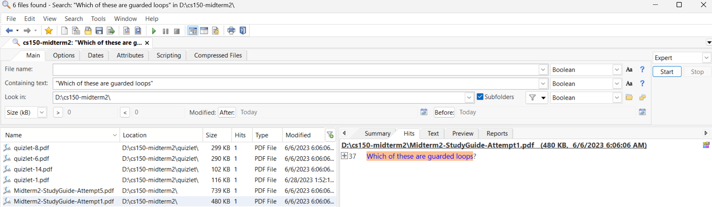

# cs150-pdf
Coursereader for C++ CS 150 converted into .pdf format
* Key: For slides A = 1, B = 2, C = 3,... Z = 26

## Download
* Using git: `git clone https://github.com/gogocplusplus/cs150-midterm2.git`
* Using google drive: https://drive.google.com/drive/folders/1U0fwFJCvnp-j33A2JbKj0fhouDYK1zwa?usp=drive_link
* Releases: https://github.com/gogocplusplus/cs150-pdf/releases
* Releases (pdf-only): only the combined .pdf files (example: ch01.pdf - ch28.pdf)
* Releases (pdf-all): with subfolders with chapter pdfs (example: ch01.pdf - ch28.pdf + ch01 - ch28 folders with subpdfs + tableofcontents with .txt files with headings)
* Disregard the Source code .zip and tar.gz

## Searching through pdf files using free optional search tool (for Windows)
### Agent Ransack / Filelocator Lite
* https://www.mythicsoft.com/ or https://www.mythicsoft.com/agentransack/

### Example of using search

## Downloaded using coursereader-downloader
* https://github.com/gogocplusplus/coursereader-downloader